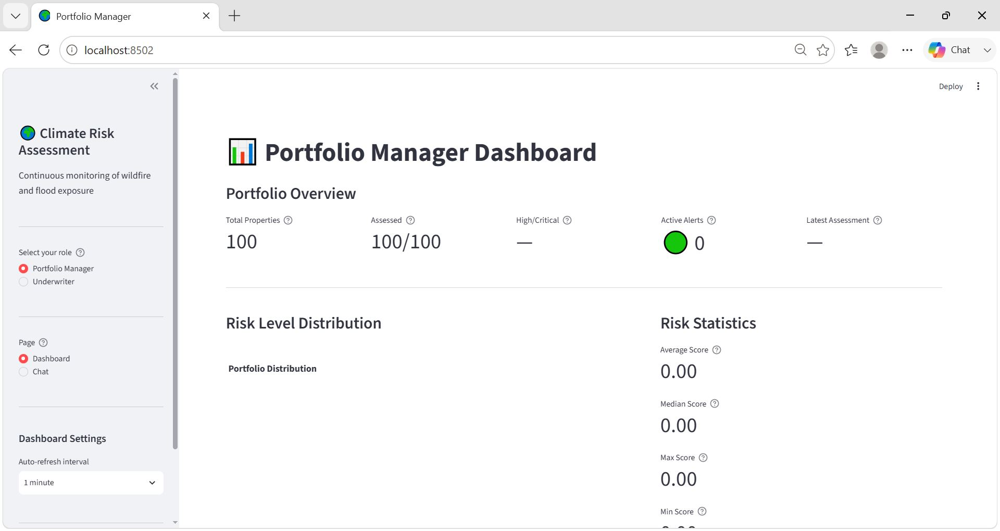
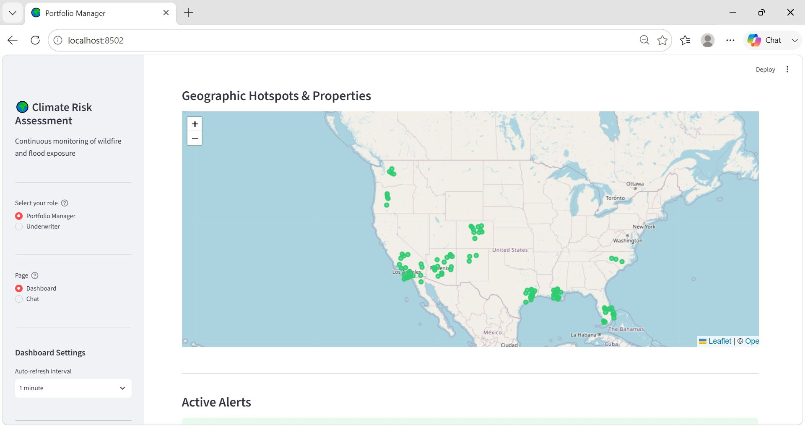
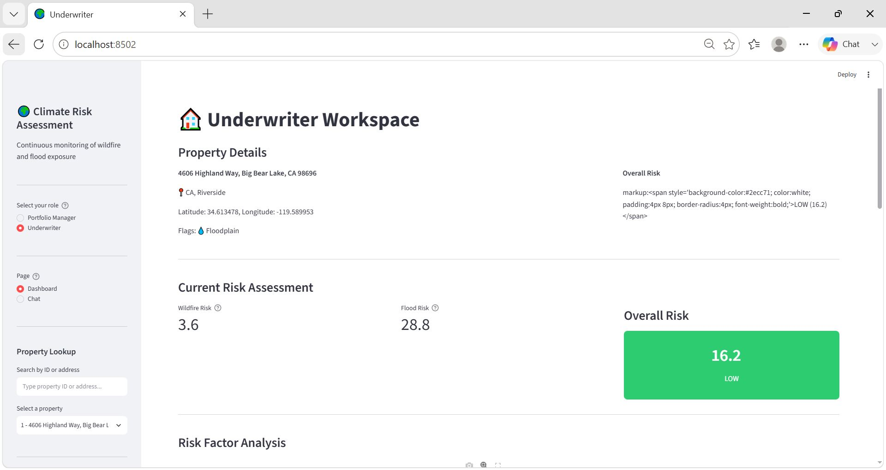
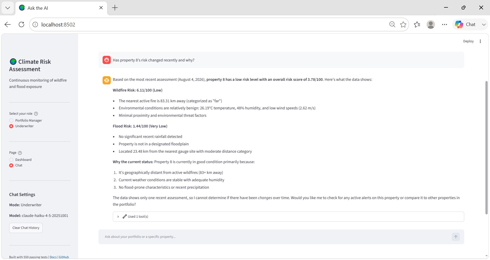
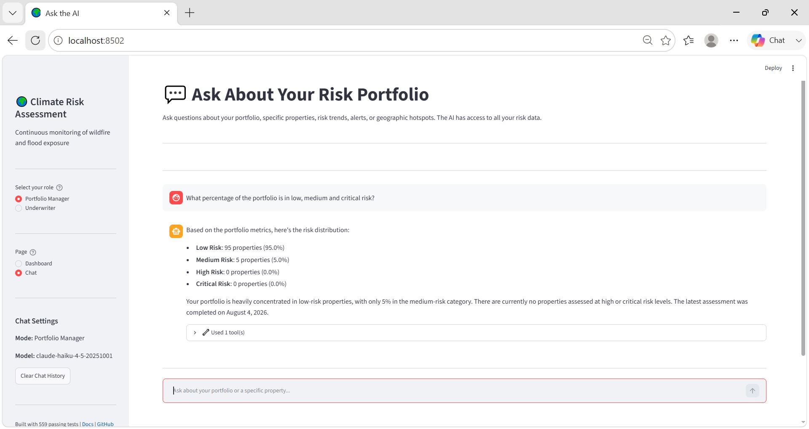

# Climate Risk Assessment - Continuous Monitoring Data Product

An AI-powered geospatial risk monitoring agent that continuously assesses wildfire and flood exposure for insured properties, enabling dynamic underwriting, portfolio risk visibility, and proactive mitigation.

## Problem Statement

Insurance industry currently:
- Assesses risk only once at policy inception (static approach)
- Relies on outdated hazard maps
- Lacks real-time exposure visibility across portfolios
- Suffers sudden catastrophic losses due to poor accumulation tracking
- Provides limited early warning for customers

## Solution

A continuous monitoring system that:
- **Ingests** real-time hazard data (wildfires, floods, weather)
- **Scores** property-level risk dynamically based on environmental changes
- **Monitors** continuously and triggers alerts when risk thresholds breach
- **Aggregates** portfolio-level exposure and detects hotspots
- **Integrates** with underwriting, claims, and pricing workflows
- **Notifies** stakeholders (underwriters, brokers, customers) of emerging risks

## Project Components

1. **Data Ingestion Layer** — Property and real-time hazard data sources
2. **Risk Scoring Engine** — Dynamic risk assessment based on proximity, environmental factors
3. **Continuous Monitoring** — Real-time change detection and event tracking
4. **Alert System** — Actionable notifications to stakeholders
5. **Portfolio Management** — Hotspot detection and accumulation monitoring
6. **Integration Layer** — Underwriting, claims, and pricing system connectors

## Screenshots

### Portfolio Manager Dashboard
<a href="docs/app_screenshots/Portfolio_Manager_Dashboard.JPG">
  
</a>
**Portfolio Manager View** — Real-time portfolio KPIs, risk distribution charts, and active alerts at a glance.

### Geographic Visualization with Hotspot Detection
<a href="docs/app_screenshots/Portfolio_Manager_Dashboard_MapUI.JPG">
  
</a>
**Map Visualization** — Interactive map showing property locations (colored by risk level) and geographic hotspot clusters for wildfire and flood exposure.

### Underwriter Workspace
<a href="docs/app_screenshots/Underwriter_Dashboard.JPG">
  
</a>
**Underwriter Workspace** — Property-level risk details with factor breakdowns, historical risk trends, and related alerts for informed underwriting decisions.

### AI-Powered Chat Interface
<a href="docs/app_screenshots/Underwriter_LLM_UI.JPG">
  
</a>
**Claude AI Chat** — Natural language Q&A powered by Claude. Ask questions about properties, portfolio exposure, risk factors, and get instant AI-generated answers with data context.

### LLM Query Examples
<a href="docs/app_screenshots/Portfolio_Manager_Dashboard_LLM_UI.JPG">
  
</a>
**Intelligent Insights** — Claude analyzes portfolio data to answer complex questions like "How many properties are in critical risk?" or "Show me the top hotspots by state."

## Documentation

**For Stakeholders/Managers (Quick Overview):**
- [docs/SOLUTION_ARCHITECTURE.md](docs/SOLUTION_ARCHITECTURE.md) — Executive overview, value prop, deployment models, ROI

**Start Here (Technical):**
- [CLAUDE.md](CLAUDE.md) — Project vision, architecture, structure, and development phases

**Architecture & Design:**
- [docs/ARCHITECTURE_HIGH_LEVEL.md](docs/ARCHITECTURE_HIGH_LEVEL.md) — System overview, layers, data flows
- [docs/ARCHITECTURE_LOW_LEVEL.md](docs/ARCHITECTURE_LOW_LEVEL.md) — Component details, algorithms, request flows
- [docs/reference-principles.md](docs/reference-principles.md) — Design principles guiding development
- [docs/task-breakdown.md](docs/task-breakdown.md) — All 35 tasks across 6 phases with completion status
- [docs/implementation-plan.md](docs/implementation-plan.md) — Original backend implementation strategy

**Phase Completion Summaries:**
- [docs/PHASE_1_UI_COMPLETION.md](docs/PHASE_1_UI_COMPLETION.md) — Web UI foundation (Streamlit pages & components)
- [docs/PHASE_2_LLM_COMPLETION.md](docs/PHASE_2_LLM_COMPLETION.md) — LLM query layer (Claude integration & tools)
- [docs/PHASE_3_COMPLETION.md](docs/PHASE_3_COMPLETION.md) — Polish & optimization (caching, export, responsive design, testing)

**Operations & Development:**
- [docs/operations-guide.md](docs/operations-guide.md) — Installation, configuration, running, monitoring, troubleshooting
- [docs/api-reference.md](docs/api-reference.md) — Full class/function reference for developers
- [docs/alert-lifecycle-design.md](docs/alert-lifecycle-design.md) — Alert generation, triggering, and persistence
- [docs/scaling-design.md](docs/scaling-design.md) — Performance optimization and scaling considerations

**Roadmap & Future Work:**
- [docs/future-roadmap.md](docs/future-roadmap.md) — Post-Phase 3 roadmap (advanced LLM features, underwriting/claims integration)

## Getting Started

All 35 implementation tasks (Phases 1-6) are complete. See
[docs/operations-guide.md](docs/operations-guide.md) for installation and
setup, then:

```bash
python src/main.py --mode test     # run one monitoring cycle
python src/main.py --mode report   # view current portfolio status
python src/main.py --mode run      # start continuous monitoring
```

## Contributing

See project documentation for development guidelines and reference principles.
